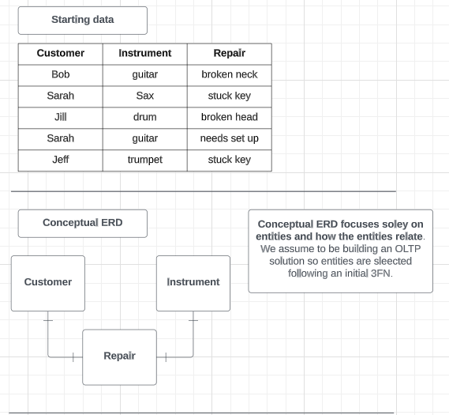

# Database Framework 

| Term | Definition |
| -------- | ------- |
| Relational DB | A structured DB that is designed to operate based on the relationships between database objects |
| Data Model | Abstract model created to structure data into a format that can be used to define a real-workd object or concept|
| Schema | Physical blueprint of a DB design |
| Normalization | Process of organizing data into a format that can be used to define a real-world object or concept |
| 3rd Normal Form | A common level of data normalization foiund in transactional relation databases | 

**Data model**
* We need *entities*, *attributes* and *relationships* to build a relational model. Entities are concepts or items we wasnt to collect data on. An entity has many attributes. The entities would be connected via relationships
* The three most common levels of relational modelling are conceptual, logical, and physical.
  * The *conceptual* model focuses slowly on entites and how entites relate
  * The *logical* model focuses on entites, attributes and relationships
  * The *physical* model adds data types, use computer-friendly naming conventions and address relationships

 **Schema**
 * The schema is the physical blueprint of the database. This is not the physical model, although they look similar. On paper, they may actrually look the same. But the schema is what happens when you take the physical data model,
   pull it from the abstract, and turn it into a physical database.
 * For this reason - a schema is created with a single databse management system in mind (e.g. MS SQL Server, Oracle, etc.), while a physical data model can be applied to any system.

**Normalization**
* Data normalization is a method of **reorganizing data** for use in a relational database.
* It is the most preferred choice fro transactional-based work, given that increases writing speed and saves memory, enforcing data integrity. The downside of normalized data is that they are not easy to read and they may require significant work to answer to simple queries.
* Normalizing data to the *3rd Normal Form (3NF)* is the most common normalization form when working with transactional data.
* To get to data normalized to the 3NF, the steps are:
  *  Data need to be in 1NF:
     *  Use entities (tables)
     *  Each cell in an attribute (column) has an atomic value (a single value)
     *  No repeated groupings as attributes
     *  No duplicate rows 
  *  Data need to be in 2NF:
     *  Entity (table in 1NF)
     *  Ensure Data Integrity, through the use of unique IDs: all columns depend on the unique ID. This means to identify dependent columns which need to be brought out in a new table
  * Remove **transitive** dependencies among attributes through new entities tables

**Example of a normalization to the third form**

  

# Relational Data Design 

**Entity Relationship Diagram (ERD)** 
* Industry standard for DB design and diagramming. It incorporates all the data modelling elements such as entities, attributes, and relationships.
* The three most common levels of relational modelling are conceptual, logical, and physical.

*Conceptual ERDs*
* Conceptual ERDs are often a first pass, and the relationships between entitites are not fully defined. It is common to have to return to your conceptual model to adjust relationships as the model is more fully fleshed out.
* The conceptual model simply has the entities and lines indicating their relationship paths.
* You can follow these steps to build a conceptual ERDs:
  * Determine the type of database to be designed (OLTP Vs OLAP)
  * Evaulate data (if provided)
  * Put data into 3NF (if required)
  * Place entites on the diagram
  * Connect entities with a relationship line

*Logical ERDs with PK-FK*
* Logical ERD adds *attributes* to the conceptual one and fine-tune *relationship* lines, introducing the concept of *primary (PK)* and *foreign (FK) keys*:
  * PK is a columns or a set of columns (combined primary key) in a table that uniquely identifies each row in the table. The main rules of primary key are:
    * It has to uniquely identify each row
    * It cannot be a NULL value
    * It can be numbers, letters oir both
  * FK is a correspnding column in a table that *references* a PK from another table. **The PK-FK establish the relationship between two or more entities**. The main rules of foreign key are:
    * It must correspond to PK in another table
    * It can be a NULL 
    * PK-FK pair defines the relationship between tables
* A logical ERD is built following the following steps:
  * Take the conceptual ERD
  * Identify attributes
  * Identify PK and FK
  * Draw relationships among entities using PK-FK pairs

*Cardinality and Crow's Foot Notation*
* Cardinality defines the relationship of a data element in one entity with respect to that same element in another entity. Namely, it refers to how oftern the data element appears in the two entities.
* Cardinality can take the following values:
  *  one to one (one to zero)
  *  one to many (one to zero; one to one or many)
  *  many to many
* Crow's Foot notation is one of the notation methods commonly used to denote cardinality in an ERD

*Physical ERDs*
* Building out physical ERDs is the last step in ERD development. This is usually done after the DBMS has been decided on, allowing for the correct data types to be selected. Although, it could be done beforehand using generic data types.
* The main points to remeber here are:
  * Add data types
  * Use computer-friendly labels
  * Add cardinality notation
  * Follow ERDs best practices

  

# Creating a physical database schema 

*Databse performances*
* Important distinction: DB Vs DBMS - A *database* is the set of data held in a defined structure in a computer, while a DBSM - database management system - is the software used to access the database.
* There are many factors that can harm a databse:
  *  Massive amount of data
  *  Complex queries (incl. complex joins) - argument in favour of denormalized data 
  *  Insufficient hardware
  *  Poor network performance
* *Cache* and *Indexing* can improve database performance
  * Cache is a place to store commonly used data in high-performance memory so the futire queries for the data can run faster. There are three types of cache: internal, external, and enterprise cache.
  * Index is creating a lookup table for a databse. It is specifically tuned to search for specific information in a table. 

*DDL to create a database*
* Data Definition Language (DDL), is a subset of SQL commands used to *create*, *modify* and *delete* database objects. In PostgreSQL, the most commonly used DDL commands are *create*, *alter*, *drop*
* *SERIAL* is a special data type. This is an auto-incrementing integer: it starts counting at 1 and it continues up for each row you add to the table. It is used for creating unique IDs.

